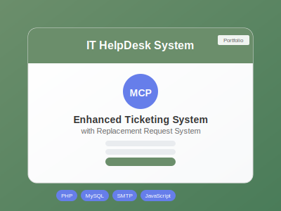

# 📸 Add Your Enhanced Ticketing System Image

## Quick Steps:

### 1. **Take a Screenshot**
- Open your Enhanced Ticketing System (IT HelpDesk)
- Take a screenshot of the login interface you showed me
- Make sure the Medical Center Parañaque logo is visible (it will be blurred automatically)

### 2. **Prepare the Image**
- **Crop** the screenshot to focus on the main interface
- **Resize** to approximately **400x300 pixels** (or maintain 4:3 aspect ratio)
- **Save as**: `ticketing-project.jpg` or `ticketing-project.png`

### 3. **Replace the Placeholder**
- **Delete** the current file: `images/ticketing-project.svg`
- **Add** your screenshot as: `images/ticketing-project.jpg`
- **Update** the HTML file to use `.jpg` instead of `.svg`

### 4. **Update HTML (if needed)**
In `index.html`, change line 260 from:
```html

```
to:
```html

```

## 🎯 **Current Status:**
- ✅ Enhanced Ticketing System project is configured in portfolio
- ✅ Placeholder image is showing (SVG)
- ⏳ **NEXT**: Replace with your actual screenshot

## 📋 **Image Requirements:**
- **Format**: JPG or PNG
- **Size**: 400x300px recommended
- **Content**: Your IT HelpDesk login interface
- **Quality**: High resolution for crisp display

## 🚀 **Result:**
Once you add your actual screenshot, visitors will see:
- Your real Enhanced Ticketing System interface
- Professional project presentation
- Clickable "View Details" button with full project information

The portfolio is ready - just add your image! 🎉
